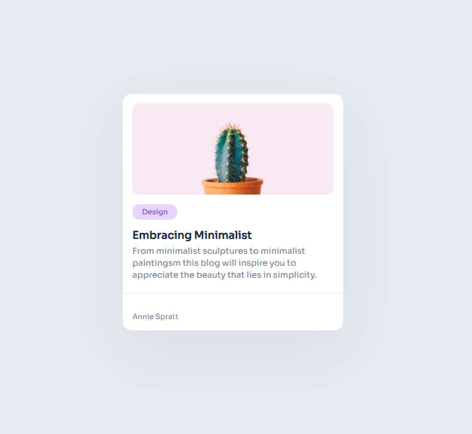

# Minimal Blog Card

This a solution of a beginner challengue that I've solved. I used HTML and CSS for making this card.

You can do more of these challengues in [devchallengues.io.](devchallengues.io) 